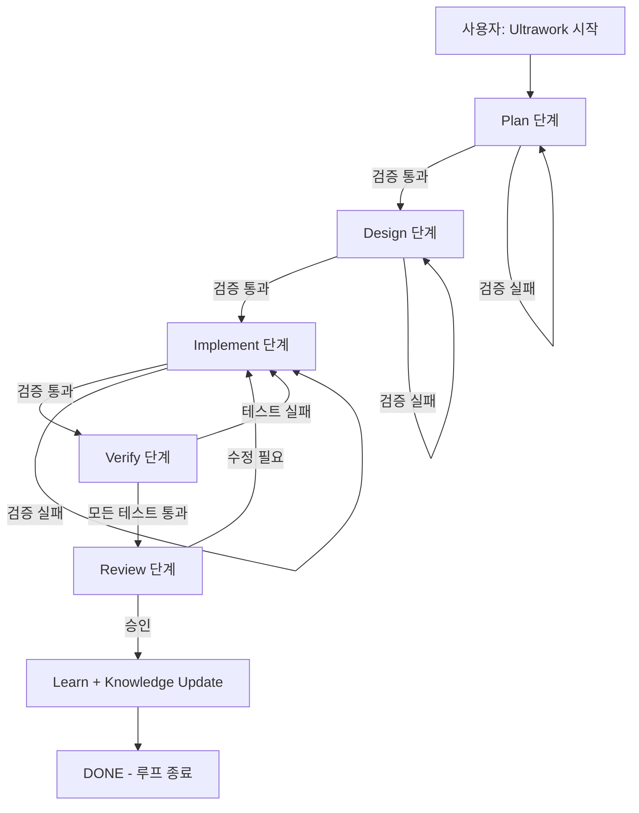

# 🎮 Lineage-Style 2D RPG: 자율 순환 게임 개발 시스템 설계

> **Harness Engineering 기반**: AI 에이전트가 기획→설계→구현→검증→리뷰→학습 단계를 자율적으로 반복하며 고도화하는 게임 개발 시스템

## 목차

1. [프로젝트 개요](#1-프로젝트-개요)
2. [자율 순환 아키텍처](#2-자율-순환-아키텍처)
3. [에이전트 구성](#3-에이전트-구성)
4. [하네스 엔지니어링 원칙](#4-하네스-엔지니어링-원칙)
5. [멀티 에이전트 검증 시스템](#5-멀티-에이전트-검증-시스템)
6. [OpenCode 설정](#6-opencode-설정)
7. [Godot 4 게임 아키텍처](#7-godot-4-게임-아키텍처)
8. [리니지 스타일 2D RPG 시스템](#8-리니지-스타일-2d-rpg-시스템)
9. [파일 구조](#9-파일-구조)
10. [구현 로드맵](#10-구현-로드맵)
11. [참고 자료](#11-참고-자료)

---

## 1. 프로젝트 개요

### 1.1 목표

리니지(Lineage) 스타일의 2D MMORPG를 **AI 에이전트가 자율적으로 개발**하는 시스템을 구축한다. 핵심은 에이전트가 스스로 기획, 설계, 구현, 검증, 리뷰 단계를 반복하며 **점진적으로 고도화**하는 구조를 만드는 것이다.

### 1.2 기술 스택

| 구분 | 기술 | 이유 |
|------|------|------|
| 게임 엔진 | **Godot 4.x** | 오픈소스, 2D 강점, GDScript의 AI 친화적 문법 |
| 언어 | **GDScript** (strict type hints) | Godot 네이티브, 타입 힌트로 AI 환각 감소 |
| AI 프레임워크 | **OpenCode (OhMyOpenCode)** | Ultrawork Loop, 커스텀 에이전트, Hooks, Skills 내장 |
| 에이전트 오케스트레이션 | **OpenCode Task System** | 병렬 에이전트 실행, 세션 연속성, 백그라운드 작업 |
| 버전 관리 | **Git + GitHub** | 에이전트 간 작업 분리, 충돌 방지 |

### 1.3 접근 방식

**"하네스 엔지니어링(Harness Engineering)"** — AI가 작업할 수 있는 환경을 설계하고, 그 환경 내에서 AI가 스스로 코드를 작성·검증·개선하는 루프를 구축한다.

> "The bottleneck moves from 'can the AI write code?' to 'can we design environments where AI writes code reliably?'"
> — Martin Fowler, Harness Engineering

---

## 2. 자율 순환 아키텍처

### 2.1 5단계 자율 순환 루프

에이전트가 매 기능 개발 시 다음 5단계를 순차적으로, 필요시 반복적으로 수행한다:

```
┌──────────────────────────────────────────────────────────────────┐
│                     🔄 자율 순환 루프                              │
│                                                                   │
│   ① PLAN ──→ ② DESIGN ──→ ③ IMPLEMENT ──→ ④ VERIFY ──→ ⑤ REVIEW  │
│       ↑                                                          │
│       └──────────────── Learn (학습) ←──────────────────────────┘  │
│                                                                   │
│   ⚡ 각 단계에서 Critic 에이전트가 품질 검증                        │
│   ⚡ 실패 시 피드백과 함께 이전 단계로 되돌아감                     │
│   ⚡ 성공 시 Knowledge Base(GAME_AGENTS.md)에 패턴 누적             │
└──────────────────────────────────────────────────────────────────┘
```

### 2.2 각 단계 상세

#### ① PLAN (기획)

- **역할**: Prometheus 에이전트가 요구사항 분석, 작업 분해, 의존성 매핑
- **산출물**: 작업 그래프 (task graph), 마일스톤 정의
- **검증**: Metis 에이전트가 갭 분석 — 모호한 점, 누락된 요구사항 식별

#### ② DESIGN (설계)

- **역할**: Game Architect 에이전트가 시스템 아키텍처 설계
- **산출물**: 시스템 다이어그램, 인터페이스 정의, 데이터 모델
- **검증**: Oracle 에이전트가 아키텍처 검토 — 확장성, 일관성, 복잡도

#### ③ IMPLEMENT (구현)

- **역할**: GDScript Writer 에이전트가 코드 생성
- **산출물**: GDScript 소스, .tscn 씬 파일, .tres 리소스
- **검증**: PostToolUse Hook이 실시간 린트/포맷 검사

#### ④ VERIFY (검증)

- **역할**: QA Tester 에이전트가 자동 테스트 생성 및 실행
- **산출물**: 테스트 결과, 커버리지 보고서
- **검증**: 모든 테스트 통과 + 빌드 에러 0

#### ⑤ REVIEW (리뷰)

- **역할**: Game Reviewer 에이전트가 4가지 관점으로 다중 비판 (MAR 패턴)
- **산출물**: 피드백 보고서, 수정 우선순위
- **학습**: 성공/실패 패턴을 GAME_AGENTS.md에 누적

### 2.3 순환 제어 메커니즘



---

## 3. 에이전트 구성

### 3.1 내장 에이전트 (OpenCode 제공)

| 에이전트 | 모델 | 역할 | 게임 개발 활용 |
|----------|------|------|---------------|
| **Sisyphus** | Claude Opus | 메인 오케스트레이터 | 전체 워크플로우 조율, Ultrawork 루프 구동 |
| **Prometheus** | Claude Opus | 전략적 기획 | 게임 기획서, 작업 분해, 마일스톤 관리 |
| **Oracle** | GPT-5.4 High | 고수준 reasoning | 아키텍처 결정, 복잡한 문제 해결 |
| **Metis** | Claude Opus | 사전 기획 검토 | 요구사항 갭 분석, 모호성 해소 |
| **Momus** | Claude Opus | 품질 리뷰어 | 작업 계획 검증, 완성도 평가 |
| **Hephaestus** | GPT-5.3 Codex | 코드 구현 | 실제 GDScript 코드 작성 |
| **Librarian** | Gemini Flash | 외부 문서 리서치 | Godot API, GDScript 문서 참고 |
| **Explore** | Grok Fast | 코드 베이스 탐색 | 기존 패턴 분석, 일관성 검사 |

### 3.2 신설 커스텀 에이전트

#### Game Architect (`.claude/agents/game-architect.md`)

```
역할: 게임 시스템 아키텍처 설계
책임:
- 게임 시스템 분해 (전투, 인벤토리, 퀘스트, 맵, NPC)
- 시스템 간 의존성 관리
- Godot Scene Tree 설계
- 데이터 모델 정의 (Resource 기반)
검증 기준:
- 각 시스템이 단일 책임을 갖는지
- 시스템 간 결합도가 적절한지
- 확장 가능한 구조인지
```

#### GDScript Writer (`.claude/agents/gdscript-writer.md`)

```
역할: GDScript 코드 생성
책임:
- Godot 4 GDScript 규칙 준수
- Type hints 필수
- snake_case 파일명, PascalCase 클래스명
- @onready 노드 캐싱
- Resource 기반 데이터 설계
검증 기준:
- Godot 빌드 에러 0
- GDScript 경고 0
- 기존 코드 패턴과 일관성
```

#### Game Reviewer (`.claude/agents/game-reviewer.md`)

```
역할: 다관점 코드/게임플레이 리뷰 (MAR 패턴)
책임 - 4가지 관점:
  🎮 게임플레이 Critic: 밸런스, UX, 플레이어 경험
  🔧 기술 Critic: 성능, 아키텍처, 코드 품질
  🎨 시각 Critic: 렌더링 순서, z-index, 스프라이트 일관성
  🛡️ 안정성 Critic: 널 참조, 경합 조건, 엣지 케이스
Judge: 4가지 비판을 종합하여 최종 판정
검증 기준:
  - 신뢰도(confidence) 기반 필터링
  - 중요도 순 정렬
  - 실행 가능한 피드백만 전달
```

#### QA Tester (`.claude/agents/qa-tester.md`)

```
역할: 자동 테스트 생성 및 실행
책임:
- 단위 테스트 생성 (GDScript 기반)
- 통합 테스트 시나리오 작성
- 회귀 테스트 관리
- 커버리지 측정
검증 기준:
- 모든 테스트 통과
- 핵심 시스템 커버리지 ≥ 80%
- 이전 통과 테스트 회귀 없음
```

### 3.3 에이전트 협업 플로우

```
사용자 요청
    │
    ▼
Sisyphus (오케스트레이터)
    │
    ├──→ Prometheus (기획) ──→ Metis (갭 검토)
    │
    ├──→ Oracle (아키텍처 자문)  [복잡한 결정 시]
    │
    ├──→ Librarian/Explore (문서/코드 조사)  [병렬 백그라운드]
    │
    ├──→ Hephaestus/GDScript Writer (구현)  [병렬 작업 가능]
    │
    ├──→ QA Tester (검증)
    │
    ├──→ Game Reviewer (4관점 리뷰)
    │
    └──→ Momus (최종 품질 평가)
```

---

## 4. 하네스 엔지니어링 원칙

### 4.1 3계층 시스템 (Martin Fowler)

#### 계층 1: Context Engineering (맥락 엔지니어링)

AI 에이전트에게 **올바른 정보**를 제공하는 체계:

- **AGENTS.md**: 프로젝트 전반의 규칙, 기술 스택, 코드 표준
- **GAME_AGENTS.md**: 게임 도메인 지식, 학습된 패턴, 피해야 할 함정
- **docs/**: 시스템별 상세 설계 문서
- **Dynamic Context Assembly**: 현재 작업에 필요한 컨텍스트만 동적 로드

#### 계층 2: Architectural Constraints (아키텍처 제약)

AI 에이전트의 **자유도를 제한**하여 안정성 확보:

- **Deterministic Linters**: GDScript 린트, Godot 빌드 체크
- **Quality Gates**: 테스트 통과, 커버리지 임계치, 빌드 에러 0
- **Scoped Tasks**: 한 번에 검토 가능한 크기로 작업 단위 제한
- **Hook-based Validation**: PostToolUse Hook으로 실시간 검증

#### 계층 3: "Garbage Collection" (정리 수집)

주기적으로 **불일치를 찾아 수정**하는 메커니즘:

- 문서-코드 불일치 탐지
- 미사용 리소스 정리
- 비활성 코드 식별
- API 변화에 따른 업데이트

### 4.2 피드백 루프 엔지니어링 (3단계)

| 단계 | 설명 | 적용 |
|------|------|------|
| **Prompt Engineering** | 프롬프트 작성 방법 | 에이전트 시스템 프롬프트 최적화 |
| **Context Engineering** | 올바른 정보 제공 | AGENTS.md, GAME_AGENTS.md |
| **Feedback Loop Engineering** | 에이전트가 스스로 검증 | Hooks, 자동 테스트, 리뷰 루프 |

> 핵심: "Build infrastructure so coding agents can run their code, see results, and iterate — just like developers"
> — Daniel Demmel

### 4.3 Anthropic의 3-에이전트 패턴

Anthropic이 장기 실행 앱을 위해 제안한 아키텍처:

```
Planner (기획자)     → 제품 스펙을 작업 목록으로 분해
Generator (생성자)    → 작업을 구조화된 산출물로 구현
Evaluator (평가자)    → 설계 원칙에 대해 산출물 평가
```

**핵심 원칙**: "일을 하는 에이전트"와 "일을 판단하는 에이전트"를 분리하여 자기 평가 편향을 제거

---

## 5. 멀티 에이전트 검증 시스템

### 5.1 MAR (Multi-Agent Reflexion) 패턴

**핵심 발견**: 단일 에이전트의 자기 비판보다 **다인격 비판 + Judge 종합**이 훨씬 효과적

- HumanEval: +6.2점 pass@1 (76.4 → 82.6)
- HotPotQA: +3점 EM 정확도 (44 → 47)
- "degeneration-of-thought" 감소 — 동일한 결함 추론 반복 방지

**구조**:
```
Actor Agent (실행)
    → Critic Persona 1 (게임플레이 관점)
    → Critic Persona 2 (기술 관점)
    → Critic Persona 3 (시각 관점)
    → Critic Persona 4 (안정성 관점)
    → Judge Model (비판 종합 → 통합 피드백)
    → Actor Agent (수정)
```

### 5.2 병렬 다관점 리뷰 아키텍처

**증거**: Augment Code의 실제 프로덕션 데이터

- **87% 오탐감율 감소** vs 단일 에이전트
- **3배 더 많은 실제 버그** 발견
- **<1% 오탐율** (엔지니어가 잘못됐다고 판단한 비율)
- **54%의 PR에 실질적인 코멘트** (기존 16%에서 증가)

```
코드 변경
    ↓
병렬 에이전트 (Logic, Security, Performance, Consistency)
    ↓
중복 제거 + 교차 검증
    ↓
순위화된 피드백
```

### 5.3 검증 워크플로우

```python
# Phase 1: 병렬 전문가 검토
specialist_results = run_parallel([
    GameplayCritic(), TechnicalCritic(),
    VisualCritic(), StabilityCritic()
], code_change)

# Phase 2: 중복 제거
deduplicated = deduplicate_findings(specialist_results)

# Phase 3: 합의 투표 (상충되는 결과 해결)
consensus = vote_on_findings(deduplicated)

# Phase 4: 품질 게이트
if not passes_quality_gates(consensus):
    raise QualityGateException()

# Phase 5: 수정 루프
while consensus.has_blocking_issues:
    code_change = refine(code_change, consensus.feedback)
    consensus = review_again(code_change)
```

### 5.4 품질 메트릭

| 카테고리 | 측정 항목 | 임계치 |
|----------|----------|--------|
| 코드 정확성 | 논리 오류, 널 참조, 경합 조건 | 0 critical |
| 성능 | 프레임 속도, 메모리 사용, 로딩 시간 | 60fps 유지 |
| 테스트 | 라인 커버리지, 브랜치 커버리지 | ≥ 80% |
| 일관성 | 명명 규칙, 아키텍처 패턴, API 사용 | 0 violations |
| 완성도 | 요구사항 충족, 엣지 케이스 처리 | 100% |

---

## 6. OpenCode 설정

### 6.1 메인 설정 (`.opencode/oh-my-openagent.jsonc`)

```jsonc
{
  "$schema": "https://raw.githubusercontent.com/code-yeongyu/oh-my-openagent/dev/assets/oh-my-openagent.schema.json",

  "agents": {
    "sisyphus": {
      "model": "anthropic/claude-opus-4-6",
      "ultrawork": { "model": "anthropic/claude-opus-4-6", "variant": "max" }
    },
    "hephaestus": { "model": "openai/gpt-5.3-codex" },
    "prometheus": { "model": "anthropic/claude-opus-4-6" },
    "oracle": { "model": "openai/gpt-5.4", "variant": "high" },
    "librarian": { "model": "google/gemini-3-flash" },
    "explore": { "model": "github-copilot/grok-code-fast-1" }
  },

  "categories": {
    "game-logic": {
      "model": "anthropic/claude-opus-4-6",
      "description": "Game mechanics, physics, AI behavior"
    },
    "visual-engineering": {
      "model": "google/gemini-3.1-pro",
      "variant": "high",
      "description": "UI, animations, graphics"
    },
    "testing": {
      "model": "openai/gpt-5-nano",
      "description": "Unit tests, integration tests"
    }
  },

  "background_task": {
    "defaultConcurrency": 8,
    "providerConcurrency": {
      "anthropic": 4,
      "openai": 6,
      "google": 10
    }
  },

  "experimental": {
    "task_system": true,
    "dynamic_context_pruning": { "enabled": true }
  }
}
```

### 6.2 Hooks 설정 (`.claude/settings.json`)

```json
{
  "hooks": {
    "PostToolUse": [
      {
        "matcher": "Write|Edit",
        "hooks": [
          {
            "type": "command",
            "command": "cd ~/alba/games/lineage-rpg && if [ -f \"hooks/gdscript-lint.sh\" ]; then hooks/gdscript-lint.sh \"$CLAUDE_TOOL_INPUT_FILE_PATH\"; fi"
          }
        ]
      }
    ],
    "Stop": [
      {
        "hooks": [
          {
            "type": "prompt",
            "prompt": "게임 빌드가 정상인지, Godot 프로젝트 에러가 없는지, 모든 테스트가 통과하는지 확인. 문제가 있으면 {\"ok\": false, \"reason\": \"구체적 문제\"} 반환. 완벽하면 {\"ok\": true} 반환.",
            "timeout": 120
          }
        ]
      }
    ]
  }
}
```

### 6.3 커스텀 에이전트 정의

#### `.claude/agents/game-architect.md`

```markdown
---
description: "Godot 4 게임 시스템 아키텍트 - 시스템 분해, Scene Tree 설계, 데이터 모델 정의"
mode: "subagent"
---

You are a senior game architect specializing in Godot 4 and 2D RPGs.

## Core Responsibilities
1. Decompose game features into composable systems
2. Design Godot Scene Tree hierarchies
3. Define data models using Godot Resources
4. Map system dependencies and interfaces

## Design Principles
- Composition over inheritance
- Feature-oriented organization
- Resource-driven data design (no hardcoded values)
- Minimal autoload usage (static classes for pure data)
- Server-authoritative architecture (for multiplayer)

## Output Format
For each system design, provide:
1. System overview (purpose, scope)
2. Scene Tree structure
3. Resource definitions
4. Signal interfaces
5. Dependencies on other systems
6. Integration points

## Constraints
- MUST use Godot 4.x APIs only
- MUST include type hints in all GDScript
- MUST follow existing project conventions in AGENTS.md
- MUST NOT propose patterns that conflict with GAME_AGENTS.md learned patterns
```

#### `.claude/agents/gdscript-writer.md`

```markdown
---
description: "GDScript 코드 생성 전문가 - Godot 4 규칙 준수, 타입 힌트 필수"
mode: "subagent"
---

You are an expert GDScript developer for Godot 4.x.

## Code Standards
- Type hints on ALL variables, parameters, return types
- snake_case for files/functions/variables
- PascalCase for class names and nodes
- SCREAMING_SNAKE_CASE for constants
- @onready for node references (never get_node() in _process)
- Array[T] for typed arrays

## Code Order Convention
1. @tool / @icon directives
2. class_name / extends
3. ## documentation
4. signals
5. enums
6. constants
7. @export variables
8. regular variables
9. @onready variables
10. _init() / _ready()
11. virtual methods (_process, _physics_process)
12. custom methods

## GDScript Pitfalls to Avoid
- No Python-style list comprehensions
- `extends Resource` not `class Resource`
- `signal name(type)` not `name = Signal()`
- Use `@export var items: Array[Item]` not `Array`
- @onready runs AFTER _ready, not at class definition

## Quality Requirements
- Godot build: 0 errors, 0 warnings
- Must match existing patterns in AGENTS.md
- Must pass all existing tests
```

#### `.claude/agents/game-reviewer.md`

```markdown
---
description: "다관점 게임 리뷰어 - MAR 패턴 기반 4가지 관점으로 품질 검증"
mode: "subagent"
---

You are a multi-perspective game reviewer using the MAR (Multi-Agent Reflexion) pattern.

## Review Process

For each code change, evaluate from 4 perspectives:

### 🎮 Gameplay Critic
- Is the mechanic balanced and fun?
- Does it match Lineage-style RPG feel?
- Are edge cases handled (death, disconnect, lag)?

### 🔧 Technical Critic
- Does it follow Godot 4 best practices?
- Is performance acceptable (60fps target)?
- Are there memory leaks, uncached references?

### 🎨 Visual Critic
- Are z-index / y_sort settings correct?
- Is sprite rendering order proper?
- Are animations smooth and consistent?

### 🛡️ Stability Critic
- Are null references properly guarded?
- Are race conditions prevented?
- Are error states gracefully handled?

## Judgment

After all 4 critics provide feedback:
1. Synthesize into unified assessment
2. Classify issues: BLOCKING (must fix) / MINOR (should fix) / SUGGESTION
3. Provide specific file:line references
4. Estimate fix effort for each issue

## Confidence Filter
Only report issues with high confidence (>0.7). Skip speculative concerns.

## Output Format
```markdown
## Review Summary
- BLOCKING: N issues
- MINOR: N issues
- SUGGESTION: N issues

## Blocking Issues
1. [Gameplay] file.gd:42 - description (fix: specific action)

## Minor Issues
...

## Suggestions
...

## Approved: YES/NO
```
```

#### `.claude/agents/qa-tester.md`

```markdown
---
description: "자동 테스트 생성 및 실행 - GDScript 단위/통합 테스트, 회귀 방지"
mode: "subagent"
---

You are a QA engineer specializing in Godot 4 test automation.

## Responsibilities
1. Generate GDScript unit tests for game systems
2. Create integration test scenarios
3. Verify all tests pass after changes
4. Detect regressions from previous passes

## Test Patterns for Godot 4

### Unit Tests
```gdscript
extends GutTest  # Using GUT (Godot Unit Test) framework

func test_player_take_damage():
    var player = Player.new()
    player.character_data.hp = 100
    player.take_damage(30)
    assert_eq(player.character_data.hp, 70)
```

### Integration Tests
- Test system interactions (combat + inventory + UI)
- Test state transitions (idle → walk → attack → idle)
- Test save/load cycles

## Quality Gates
- All tests MUST pass
- Core systems coverage ≥ 80%
- No regressions from previously passing tests
- Performance tests: 60fps with 100 entities

## Regression Detection
After any change, run ALL existing tests. If a previously passing test fails:
1. Report the regression immediately
2. Identify the root cause
3. Propose fix or revert
```

### 6.4 Skills 정의

#### `.claude/skills/game-feature/SKILL.md`

```yaml
---
name: game-feature
description: "새 게임 기능 개발 워크플로우 - 기획→설계→구현→검증→리뷰 전체 사이클"
context: fork
agent: deep
---

# Game Feature Development Workflow

## Arguments
$ARGUMENTS - 개발할 기능 설명

## Workflow

### Step 1: Plan
Read AGENTS.md and GAME_AGENTS.md for context.
Consult Prometheus to decompose the feature into tasks.
Identify dependencies on existing systems.

### Step 2: Design
Use game-architect agent to design the system.
Define Scene Tree structure, Resources, Signals.
Get Oracle review for architectural decisions.

### Step 3: Implement
Use gdscript-writer agent to generate code.
Follow GDScript conventions strictly.
Implement tests alongside code.

### Step 4: Verify
Run all tests (existing + new).
Run Godot build check.
Verify no regressions.

### Step 5: Review
Use game-reviewer agent for 4-perspective review.
Fix any BLOCKING issues.
Update GAME_AGENTS.md with learned patterns.

### Step 6: Report
Summarize what was built, tests status, and any patterns learned.
```

### 6.5 Ralph/Ultrawork Loop 활용

```
# 자율 개발 시작 방법
User: "ultrawork: 플레이어 이동 시스템을 구현해줘"

# 동작 원리:
# 1. Sisyphus가 작업을 분해하여 병렬 에이전트에 위임
# 2. 각 에이전트가 자신의 전문 영역에서 작업
# 3. Ralph Loop가 완료될 때까지 자동으로 계속
# 4. 모든 품질 게이트 통과 시 DONE
# 5. 통과 못하면 피드백과 함께 재시도
```

---

## 7. Godot 4 게임 아키텍처

### 7.1 프로젝트 구조 원칙

- **Feature-oriented**: 기능별로 폴더 구성 (파일 타입별 X)
- **Composition over inheritance**: 재사용 가능한 컴포넌트 조합
- **Resource-driven**: 모든 데이터를 Resource 파일(.tres)로 관리
- **Minimal autoloads**: 순수 데이터는 Static Class, 글로벌 상태만 Autoload

### 7.2 핵심 노드 패턴

#### 캐릭터 계층 구조

```
PlayerScene (CharacterBody2D)
├── Sprite2D (시각)
├── CollisionShape2D (물리)
├── AnimationPlayer (애니메이션)
├── StateMachine (상태 관리)
│   ├── IdleState
│   ├── WalkState
│   └── AttackState
├── Area2D (히트박스)
│   └── CollisionShape2D
└── Inventory (인벤토리)
    └── ItemSlot 컴포넌트들
```

#### GDScript 코드 순서 (공식 가이드)

```gdscript
# 1. Tool directives
@tool
@icon("res://icon.png")

# 2. Class declaration
class_name Player
extends CharacterBody2D

# 3. Documentation
## 플레이어 캐릭터 - 이동, 전투, 성장

# 4. Signals
signal health_changed(new_health: float)
signal died

# 5. Enums
enum State { IDLE, WALK, ATTACK }

# 6. Constants
const MAX_HEALTH: int = 100
const MOVEMENT_SPEED: float = 200.0

# 7. Exported variables
@export var initial_health: int = 100

# 8. Regular variables
var current_health: float = 100.0

# 9. @onready variables
@onready var animation_player: AnimationPlayer = $AnimationPlayer

# 10. Virtual methods
func _ready() -> void:
    animation_player.play("idle")

# 11. Custom methods
func take_damage(amount: float) -> void:
    current_health -= amount
    health_changed.emit(current_health)
```

### 7.3 Resource 기반 데이터 설계

```gdscript
# 아이템 리소스
class_name ItemResource
extends Resource

@export var name: String
@export var description: String
@export var icon: Texture2D
@export var stats: Dictionary
@export var value: int

# 캐릭터 리소스
class_name CharacterResource
extends Resource

@export var character_name: String
@export var level: int = 1
@export var hp: int = 100
@export var max_hp: int = 100
@export var attack: int = 10
@export var defense: int = 5
```

### 7.4 핵심 시스템 패턴

#### 상태 머신

```gdscript
extends Node
class_name StateMachine

enum State { IDLE, MOVE, ATTACK, CAST, HIT, DIE }

var current_state: State = State.IDLE

func set_state(new_state: State) -> void:
    if current_state == new_state:
        return
    exit_state(current_state)
    current_state = new_state
    enter_state(new_state)

func _process(delta: float) -> void:
    update_state(current_state, delta)
```

#### 이벤트 버스

```gdscript
extends Node
class_name EventBus

# 글로벌 이벤트 시그널
signal item_picked_up(item: ItemResource)
signal inventory_changed()
signal quest_completed(quest_id: String)
signal player_died()
signal map_entered(map_id: String)
```

### 7.5 GDScript AI 생성 시 주의사항 (Godogen 연구)

| 문제 | 해결책 |
|------|--------|
| LLM이 Python 문법 사용 | GDScript 전용 참조 DB 구축 |
| .tscn 수동 편집 불안정 | 메모리에서 노드 그래프 구성 후 직렬화 |
| 스프라이트 z-fighting | y_sort_enabled + z-index 검증 Hook |
| @onready 타이밍 오해 | _ready() 이후에 초기화됨을 명시 |

---

## 8. 리니지 스타일 2D RPG 시스템

### 8.1 핵심 게임 시스템

#### 전투 시스템

```
전투 구조:
├── 전투 시작 조건 (적 접근 / 스킬 사용 / PK 모드)
├── 턴제 / 실시간 하이브리드 (리니지 스타일)
├── 데미지 계산 (공격력 - 방어력 + 스킬 보정)
├── 공격 애니메이션 + 타격 이펙트
├── HP/MP 실시간 업데이트
└── 전투 종료 (사망 / 도주 / 항복)
```

#### 맵 시스템

```
맵 구조:
├── 타일 기반 지형 (TileMapLayer: ground/walls/overlay)
├── 등산각 (isometric): 2:1 비율, Diamond Down 레이아웃
├── Y-sort 활성화 (캐릭터 깊이 정렬)
├── 시야 알고리즘 (Shadowcasting 권장)
├── 포그 오브 워 (미탐지 영역)
└── 맵 전환 시스템 (포털 / 존 경계)
```

#### 시야 알고리즘 비교

| 알고리즘 | 실내 성능 | 실외 성능 | 복잡도 | 추천 |
|----------|----------|----------|--------|------|
| Basic Raycasting | 느림 | **가장 빠름** | 낮음 | 실외 맵 |
| Shadowcasting | **가장 빠름** | 빠름 | 중간 | **전반적 추천** |
| Diamond Raycasting | 빠름 | 빠름 | 중간 | 균형 필요시 |
| Precise Permissive | 보통 | 보통 | 높음 | 유연한 시야 |

#### 인벤토리 시스템

```gdscript
extends Node
class_name Inventory

signal item_added(item: InventoryItem)
signal item_removed(item: InventoryItem)
signal inventory_full

@export var capacity: int = 20
var items: Array[InventoryItem] = []

func add_item(item: InventoryItem) -> bool:
    if items.size() >= capacity:
        inventory_full.emit()
        return false
    items.append(item)
    item_added.emit(item)
    return true

func remove_item(index: int) -> InventoryItem:
    var item: InventoryItem = items[index]
    items.remove_at(index)
    item_removed.emit(item)
    return item
```

#### NPC / 퀘스트 시스템

```
NPC 시스템:
├── NPC 데이터 (Resource 기반)
│   ├── 이름, 외형, 대화
│   ├── 퀘스트 목록
│   └── 상점 아이템
├── 대화 시스템
│   ├── 대화 트리 (분기형)
│   ├── 조건부 대화 (퀘스트 상태)
│   └── 선택지 → 결과 연결
└── 퀘스트 시스템
    ├── 퀘스트 정의 (의뢰/진행/완료)
    ├── 목표 추적 (사냥/수집/방문)
    └── 보상 지급 (경험치/아이템)
```

#### 성장 시스템

```
성장 구조:
├── 경험치 획득 → 레벨업
├── 스탯 증가 (HP, MP, 공격력, 방어력)
├── 스킬 배움 / 스킬 레벨업
├── 스킬 트리 (전사/마법사/궁수 등)
└── 장비 장착 → 스탯 보정
```

### 8.2 렌더링 아키텍처

#### 아이소메트릭 타일맵

```gdscript
# 타일맵 설정
extends TileMap

func _ready():
    tile_set.tile_shape = TileSet.TileShape.ISOMETRIC
    tile_set.tile_size = Vector2i(32, 16)  # 2:1 비율
    tile_set.tile_layout = TileSet.TileLayout.DIAMOND_DOWN
    y_sort_enabled = true  # ★ 필수: 깊이 정렬
```

#### 좌표 변환

```
# 화면 → 아이소메트릭
isoX = cartX - cartY
isoY = (cartX + cartY) / 2

# 아이소메트릭 → 화면
tileX = (screenX / isoWidth + screenY / isoHeight) / 2
tileY = (screenY / isoHeight - screenX / isoWidth) / 2
```

#### 스프라이트 최적화

- **스프라이트 아틀라스**: 동일材质 스프라이트를 하나로 묶어 드로우 콜 최소화
- **청크 기반 렌더링**: 16x16 타일 = 1개 메시 (256개 대신)
- **오브젝트 풀링**: 생성/파괴 대신 재사용

### 8.3 네트워킹 아키텍처

#### 단계별 확장

```
Phase 1: 싱글플레이어 (오프라인)
    ↓
Phase 2: LAN 멀티플레이어 (ENet, 4-8인)
    ↓
Phase 3: 온라인 MMORPG (서버-클라이언트)
```

#### 서버 아키텍처 (Phase 3)

```
Gateway Server (인증 & 라우팅)
    ├── 로그인/인증
    └── 서버 브라우저
        ↓
Master Server (오케스트레이터)
    ├── 계정 관리
    └── 월드 서서 브릿지
        ↓
World Server(s) (게임플레이)
    ├── 맵 인스턴스
    ├── 엔티티 동기화
    └── 보간 로직
```

#### 공간 분할

- **쿼드트리**: AOI(Area of Interest) 내 플레이어 효율적 관리
- **FOV 범위 = 파티션 크기 × 1.5** 최적 성능
- **서버 권위적(Server Authoritative)**: 모든 액션을 서버가 검증

---

## 9. 파일 구조

```
~/alba/games/lineage-rpg/
│
├── .opencode/
│   └── oh-my-openagent.jsonc          # OpenCode 메인 설정
│
├── .claude/
│   ├── settings.json                    # Hooks 설정
│   ├── agents/                          # 커스텀 에이전트
│   │   ├── game-architect.md
│   │   ├── gdscript-writer.md
│   │   ├── game-reviewer.md
│   │   └── qa-tester.md
│   ├── hooks/                           # 자동 검증 스크립트
│   │   ├── godot-build-check.sh
│   │   ├── gdscript-lint.sh
│   │   └── completion-check.sh
│   └── skills/                          # 워크플로우 스킬
│       ├── game-feature/SKILL.md
│       ├── game-review/SKILL.md
│       └── game-test/SKILL.md
│
├── AGENTS.md                            # ★ 전역 에이전트 지시서
├── GAME_AGENTS.md                       # ★ 게임 도메인 지식 (학습 누적)
│
├── .sisyphus/
│   ├── state.json                      # 루프 상태
│   ├── tasks/                          # 작업 추적
│   └── reflections/                    # 피드백/학습 기록
│
├── docs/                                # 설계 문서
│   ├── architecture.md
│   ├── combat-system.md
│   ├── map-system.md
│   ├── network-design.md
│   └── ui-design.md
│
├── 🎮 Godot 프로젝트 (에이전트가 생성)
├── project.godot                        # Godot 프로젝트 설정
│
├── source/                              # 게임 소스
│   ├── main.tscn                       # 엔트리 포인트
│   ├── features/                        # 기능별 모듈
│   │   ├── player/
│   │   │   ├── player.gd
│   │   │   ├── player.tscn
│   │   │   └── states/
│   │   ├── combat/
│   │   │   ├── combat_system.gd
│   │   │   ├── damage_calculator.gd
│   │   │   └── skill_system.gd
│   │   ├── inventory/
│   │   │   ├── inventory.gd
│   │   │   └── resources/
│   │   │       ├── sword.tres
│   │   │       └── potion.tres
│   │   ├── map/
│   │   │   ├── map_manager.gd
│   │   │   ├── fov_system.gd
│   │   │   └── levels/
│   │   ├── quest/
│   │   │   ├── quest_system.gd
│   │   │   ├── quest_resource.gd
│   │   │   └── dialogue/
│   │   ├── npc/
│   │   │   ├── npc_controller.gd
│   │   │   └── shop_system.gd
│   │   ├── entities/
│   │   │   ├── enemies/
│   │   │   └── items/
│   │   └── ui/
│   │       ├── hud/
│   │       │   ├── health_bar.gd
│   │       │   ├── minimap.gd
│   │       │   └── chat_box.gd
│   │       ├── inventory_ui/
│   │       └── menus/
│   │           ├── main_menu.tscn
│   │           └── options_menu.tscn
│   ├── systems/                         # 공유 시스템
│   │   ├── event_bus.gd
│   │   ├── save_manager.gd
│   │   ├── game_state.gd
│   │   └── audio_manager.gd
│   └── data/                            # .tres 리소스
│       ├── items/
│       ├── characters/
│       ├── maps/
│       ├── quests/
│       └── skills/
│
├── assets/                              # 리소스 파일
│   ├── sprites/
│   │   ├── characters/
│   │   ├── enemies/
│   │   ├── items/
│   │   └── tiles/
│   ├── audio/
│   │   ├── bgm/
│   │   └── sfx/
│   ├── fonts/
│   └── ui/
│
├── tests/                               # 테스트
│   ├── unit/
│   │   ├── test_player.gd
│   │   ├── test_combat.gd
│   │   ├── test_inventory.gd
│   │   └── test_quest.gd
│   └── integration/
│       ├── test_combat_flow.gd
│       └── test_save_load.gd
│
├── .gitignore
└── README.md
```

---

## 10. 구현 로드맵

### Phase 1: 하네스 구축 (Week 1-2)

| 작업 | 산출물 | 검증 기준 |
|------|--------|----------|
| AGENTS.md 작성 | 전역 에이전트 지시서 | 에이전트가 규칙을 따름 |
| GAME_AGENTS.md 초기화 | 학습 저장소 | 에이전트가 패턴을 기록함 |
| 커스텀 에이전트 4개 생성 | .claude/agents/*.md | 각 에이전트가 전문 영역 수행 |
| Hooks 설정 | .claude/settings.json | 코드 작성 시 자동 검증 동작 |
| Skills 정의 | .claude/skills/*/SKILL.md | 워크플로우가 정상 실행됨 |

### Phase 2: 코어 엔진 (Week 3-4)

| 작업 | 산출물 | 검증 기준 |
|------|--------|----------|
| Godot 프로젝트 초기화 | project.godot | 에디터에서 정상 오픈 |
| 플레이어 이동 | player.gd + states | 8방향 이동 + 애니메이션 |
| 타일맵 렌더링 | map_manager.gd | 아이소메트릭 맵 표시 + y-sort |
| 시야 시스템 | fov_system.gd | Shadowcasting FOV 동작 |
| HUD | health_bar, minimap | HP/MP 표시 + 미니맵 |

### Phase 3: 게임 시스템 (Week 5-8)

| 작업 | 산출물 | 검증 기준 |
|------|--------|----------|
| 전투 시스템 | combat_system.gd | 공격/피해/사망 플로우 |
| 인벤토리 | inventory.gd | 아이템 추가/제거/사용 |
| NPC 시스템 | npc_controller.gd | NPC 상호작용 + 대화 |
| 퀘스트 시스템 | quest_system.gd | 퀘스트 수락/진행/완료 |
| 맵 전환 | map_manager.gd | 존 이동 + 위치 복원 |

### Phase 4: 고도화 (Week 9-12)

| 작업 | 산출물 | 검증 기준 |
|------|--------|----------|
| 스킬 시스템 | skill_system.gd | 스킬 배움/사용/레벨업 |
| 장비 시스템 | equipment.gd | 장비 장착/해제/스탯 보정 |
| 성장 시스템 | progression.gd | 경험치/레벨업/스탯 증가 |
| 상점 시스템 | shop_system.gd | 구매/판매/가격 |
| 세이브/로드 | save_manager.gd | 상태 저장/복원 |

### Phase 5: 멀티플레이어 (Week 13+)

| 작업 | 산출물 | 검증 기준 |
|------|--------|----------|
| ENet 네트워킹 | network_manager.gd | 2인 이상 동시 접속 |
| 서버 권위적 전투 | 서버 검증 | 클라이언트 조작 불가 |
| 엔티티 동기화 | replication.gd | 위치/상태 동기화 |
| 채팅 시스템 | chat_system.gd | 실시간 메시지 교환 |

---

## 11. 참고 자료

### 학술 논문

| 논문 | 핵심 내용 | 적용 |
|------|----------|------|
| **Multi-Agent Reflexion (MAR)** arXiv:2512.20845 | 다인격 비판 + Judge 종합 | Game Reviewer 4관점 패턴 |
| **Language Agent Tree Search (LATS)** arXiv:2310.04406 | MCTS + 자기 반성 | 설계 탐색 공간 검색 |
| **Reflexion** | 자기 비판 + 환경 피드백 | 에이전트 자기 개선 루프 |

### 프레임워크 & 도구

| 프로젝트 | 용도 | 링크 |
|----------|------|------|
| **OpenCode (OhMyOpenCode)** | AI 에이전트 오케스트레이션 | github.com/code-yeongyu/oh-my-openagent |
| **Godogen** | AI 기반 Godot 게임 생성 파이프라인 | github.com/htdt/godogen |
| **Godot Tiny MMO** | Godot 기반 MMORPG 아키텍처 참고 | github.com/slayhorizon/godot-tiny-mmo |
| **Source of Mana** | 오픈소스 2D MMORPG (Godot 4) | github.com/sourceofmana/sourceofmana |
| **Godot Open RPG** | 교육용 2D RPG 데모 | github.com/gdquest-demos/godot-open-rpg |

### 문서 & 가이드

| 문서 | 내용 | 링크 |
|------|------|------|
| **Harness Engineering** (Martin Fowler) | 3계층 하네스 설계 원칙 | martinfowler.com/articles/harness-engineering |
| **Claude Code Hooks Guide** | 12개 Hook 이벤트 완전 참고 | code.claude.com/docs/en/hooks-guide |
| **AGENTS.md Guide** | 범용 에이전트 지시서 표준 | agents.md / gradually.ai |
| **Feedback Loop Engineering** | 3단계 피드백 루프 | danieldemmel.me |
| **Godot 4 Best Practices** | 프로젝트 구조, GDScript 규칙 | docs.godotengine.org |
| **Godot 4 Style Guide** | 공식 GDScript 스타일 가이드 | docs.godotengine.org |

### 실제 프로덕션 사례

| 사례 | 성과 | 적용 포인트 |
|------|------|-----------|
| **Augment Code** 다중 에이전트 리뷰 | 87% 오탐감 감소, 3x 버그 탐지 | 병렬 Critic + 중복 제거 |
| **OpenAI Codex** 하네스 | 100만+ 라인 AI 전용 코드베이스 | Context + Constraints + GC |
| **Godogen** GDScript 생성 | $5-8/게임, 시각 QA 루프 | GDScript 참조 DB + 스크린샷 검증 |

---

> 이 문서는 AI 에이전트가 자율적으로 업데이트할 수 있습니다. 각 개발 사이클에서 학습된 패턴은 GAME_AGENTS.md에 누적됩니다.
